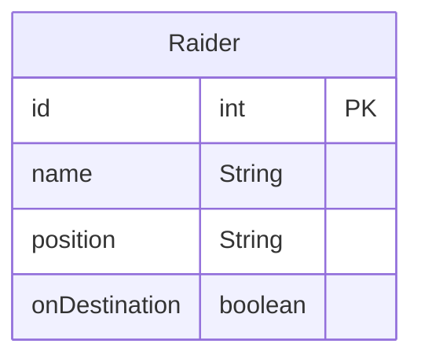

# `Flux<T>`

A Reactive Streams [`Publisher`](https://www.reactive-streams.org/reactive-streams-1.0.3-javadoc/org/reactivestreams/Publisher.html?is-external=true "class or interface in org.reactivestreams") with rx operators that emits *0 to N elements*, and then completes (successfully or with an error).

## Documentation [[\^1](https://projectreactor.io/docs/core/release/api/reactor/core/publisher/Flux.html)]

![[Reactive - Flux intro|1200]]

**Flux** represents a reactive stream that can emit **0 to N elements** (multiple values), making it ideal for handling collections and data streams in Spring Boot applications.

## Key Difference from Mono
When expecting multiple results, use `Flux`, for single results, use `Mono`
- **Mono**: 0 or 1 element (like `Optional<T>`)    
- **Flux**: 0 to many elements (like `List<T>`)

## What Flux is
`Flux` is a core reactive type in *Spring WebFlux* representing a non-blocking, asynchronous stream that can emit *zero to many elements* with support for back-pressure. In *WebFlux controllers* and *clients*, `Flux` is used to model streaming responses or collections that are produced and consumed reactively.
> [!note] 
> `Flux` is a `Publisher` from *Project Reactor* that emits *0 to N* items and then completes or errors, enabling *event-driven*, *non-blocking* data pipelines in *WebFlux*

## When to use Flux in WebFlux

- Use `Flux` to return a *stream or list-like response reactively* (e.g., streaming database rows, server-sent events, or multiple items from an API). Use `Mono` for *single-item responses* like fetching one entity or sending an acknowledgment
- Flux is ideal for high-concurrency, I/O-bound workloads where *non-blocking back-pressure* improve scalability and latency versus blocking stacks

## SpringBoot Project
### Create new project from [start.spring.io](https://start.spring.io/)
Create a new project through [start.spring.io](https://start.spring.io/) UI or via `cli` and give it proper name
```sh file:"New SpringBoot project download command" hlt:|$PROJECTNAME,13|webflux 
curl https://start.spring.io/starter.zip               \
  -d type=gradle-project                               \
  -d language=java                                     \
  -d bootVersion=3.5.5                                 \
  -d baseDir=$PROJECTNAME                              \
  -d groupId=org.booleanuk                             \
  -d artifactId=$PROJECTNAME                           \
  -d name=$PROJECTNAME                                 \
  -d description="Demo project for Spring Boot"        \
  -d packageName=org.booleanuk.demo                    \
  -d packaging=jar                                     \
  -d javaVersion=21                                    \
  -d dependencies=webflux,devtools,postgresql,data-jpa \ # [!note] Note the `webflux` dependency instead of `web`
  -o "$PROJECTNAME".zip
```

### Setup
#### Dependencies & Properties
The *OAuth2* require *resource server* dependency, while in the property file makes sure the proper *server port* and *uri of the issuer* are in place
```gradle file:build.gradle group:setting hlt:3|'org.springframework.boot:spring-boot-starter-webflux'
dependencies {  
	// webflux starter & test
    implementation 'org.springframework.boot:spring-boot-starter-webflux'  
    testImplementation 'org.springframework.boot:spring-boot-starter-test'  
    testImplementation 'io.projectreactor:reactor-test'  
    testRuntimeOnly 'org.junit.platform:junit-platform-launcher'  
  
	// hibernate  
	implementation 'org.springframework.boot:spring-boot-starter-data-jpa'
  
    // database  
    implementation("org.postgresql:postgresql:42.7.7")  
  
    // lombok  
    implementation("org.projectlombok:lombok:1.18.38")  
    annotationProcessor 'org.projectlombok:lombok:1.18.38'  
    testAnnotationProcessor 'org.projectlombok:lombok:1.18.38'  
}
```

### `Flux` Example Controller
In order to test `Flux` capabilities, let's create a new `FluxController.java` file
```java file:FluxController.java
@RestController  
@RequestMapping("api/flux")  
public class FluxController {  
  
    @GetMapping("hello")  
    public Flux<String> hello() {  
        return Flux.just("Hello ", "from", " Flux! "); // [!note] Switch data type `RawData --> Flux<RawData>` (multiple values)  
    }  
  
    @GetMapping("uuids")  
    public Flux<String> uuids(@RequestParam(defaultValue = "5") int count) {  
        return Flux.range(1, count) // [!note] Generate sequence of numbers  
                .map(i -> UUID.randomUUID().toString())  
                .map(u -> "generated=" + u + ";");  
    }  
  
    @GetMapping("greetings")  
    public Flux<String> greetings(@RequestParam Optional<String> name) {  
        return Flux.fromIterable(List.of("Hello", "Hi", "Hey"))  
                .map(greeting -> greeting + " " + name.orElse("guest") + " ");  
    }  
  
    @GetMapping(value = "delayed", produces = MediaType.TEXT_EVENT_STREAM_VALUE) // [!note] Use `TEXT_EVENT_STREAM_VALUE` for streaming responses like real-time values or infinite streaming  
    public Flux<String> delayed() {  
        return Flux.interval(Duration.ofMillis(1000)) // [!note] Emit values at intervals  
                .take(10) // [!note] Limit to 4 emissions  
                .map(tick -> "message #" + tick + " after " + (tick * 1000) + "ms");  
    }  
  
    @GetMapping(value = "fromCallable")  
    public Flux<String> fromCallable() {  
        return Mono.fromCallable(() -> { // [!note] Define a callable method that returns collection  
                    Thread.sleep(1000); // [!note] Simulate a blocking operation  
                    return List.of("item1", "item2", "item3", "item4");  
                })  
                .subscribeOn(Schedulers.boundedElastic()) // [!note] Offloads to separate thread pool  
                .flatMapMany(Flux::fromIterable); // [!note] Convert List to Flux stream  
    }  
  
    @GetMapping(value = "streaming", produces = MediaType.TEXT_EVENT_STREAM_VALUE)  
    public Flux<String> streaming() {  
        return Flux.fromIterable(List.of("apple", "banana", "cherry", "date"))  
                .delayElements(Duration.ofMillis(1000)) // [!note] Add delay between each element  
                .map(fruit -> "streaming: " + fruit);  
    }  
  
    @GetMapping(value = "buffered", produces = MediaType.TEXT_EVENT_STREAM_VALUE)  
    public Flux<List<String>> buffered() {  
        return Flux.range(1, 10)  
                .map(i -> "item-" + i)  
                .buffer(3); // [!note] Group elements into batches of 3  
    }  
  
    @GetMapping("filtered")  
    public Flux<Integer> filtered() {  
        return Flux.range(1, 20)  
                .filter(n -> n % 2 == 0) // [!note] Filter even numbers only  
                .take(5); // [!note] Take first 5 matching elements  
    }  
}
```

### Real world scenario
In a **Food Delivery App** there is `Raider` entity


> [!note] 
> **Position** the position of the raider expressed in GPS coordinates
> **onDestination** flag attribute reporting `Raider` is arrived on destination or not

And all related class (*entity*, *DTO*s, *repository* and *service*)
```java file:Raider.java group:Raider
@Entity  
@Data  
@Builder  
@NoArgsConstructor  
@AllArgsConstructor  
public class Raider {  
  
    @Id  
    @GeneratedValue(strategy = GenerationType.IDENTITY)  
    private int id;  
  
    private String name;  
    private String position;  
  
    private boolean onDestination = false;  
}
```
```java file:RaiderDto.java group:Raider
@Data  
@NoArgsConstructor  
@AllArgsConstructor  
public class RaiderDto {  
  
    private String name;  
    private String position;  
}
```
```java file:RaiderPositionDto.java group:Raider
@Data  
@NoArgsConstructor  
@AllArgsConstructor  
public class RaiderPositionDto {  
  
    private String position;  
    private boolean onDestination = false;  
}
```
```java file:RaiderRepo.java group:Raider
public interface RaiderRepo extends JpaRepository<Raider, Integer> {  
}
```
```java file:RaiderService.java group:Raider
@Service  
public class RaiderService {  
  
    private final RaiderRepo repository;  
  
    public RaiderService(RaiderRepo repository) {  
  
        this.repository = repository;  
    }  
  
    public Mono<List<Raider>> findAll() {  
  
        return Mono.fromCallable(repository::findAll)  
                .subscribeOn(Schedulers.boundedElastic());  
    }  
  
    public Mono<Raider> findById(int id) {  
  
        return Mono.fromCallable(() -> repository.findById(id))  
                .subscribeOn(Schedulers.boundedElastic())  
                .flatMap(Mono::justOrEmpty);  
    }  
  
    public Mono<Raider> save(RaiderDto dto) {  
  
        return save(Raider.builder()  
                .name(dto.getName())  
                .position(dto.getPosition())  
            .build()  
        );  
    }  
    public Mono<Raider> save(Raider raider) {  
  
        return Mono.fromCallable(() -> repository.save(raider))  
                .subscribeOn(Schedulers.boundedElastic());  
    }  
  
    public Mono<Raider> update(int id, RaiderDto dto) {  
  
        return findById(id)  
            .map(raider ->  
                Raider.builder()  
                    .id(raider.getId())  
                    .name(dto.getName())  
                    .position(dto.getPosition())  
                    .onDestination(raider.isOnDestination())  
                    .build()  
            ).flatMap(this::save);  
  
    }  
    public Mono<Raider> update(int id, RaiderPositionDto dto) {  
  
        return findById(id)  
                .map(raider ->  
                    Raider.builder()  
                        .id(raider.getId())  
                        .name(raider.getName())  
                        .position(dto.getPosition())  
                        .onDestination(dto.isOnDestination())  
                        .build()  
                ).flatMap(this::save);  
    }  
  
    public Mono<Raider> delete(int id) {  
  
        return findById(id)  
                .flatMap(raider -> Mono.fromCallable(() -> {  
  
                    repository.delete(raider);  
  
                    return raider;  
                }));  
    }  
}
```

#### Client Requests
> [!note] **Customer** Story
> I want to track my delivery raider's progress in real-time until my order is delivered

> [!note] **Restaurant Manager** Story
> I want to monitor when my delivery raider reaches the customer's location

#### Implementation
The service layer will provide the `Flux` to the client and make it reactive through `subscribe` method
```java file:RaiderService.java 
public Flux<Raider> subscribe(int id) {  
  
    return Flux.interval(Duration.ofSeconds(1))  // [!note] one check per second
		.flatMap(tick -> findById(id)  // [!note] get updated information from db
			.onErrorMap(ex -> new MyBadRequestException(ex.getMessage())))  
		.subscribeOn(Schedulers.boundedElastic())  
		.distinct(raider ->  // [!note] mark relevant information to not overflow clients
			List.of(raider.getPosition(), raider.isOnDestination())  
		).takeUntil(Raider::isOnDestination)  // [!note] mark the stop condition
	;  
}
```

While the controller stay as simple as possible and basically just match *service layer* with additional HTTP informations
```java file:RaiderController.java
@RestController  
@RequestMapping("api/raider")  
public class RaiderController {  
  
    private final RaiderService raiderService;  
  
    public RaiderController(RaiderService raiderService) {  
  
        this.raiderService = raiderService;  
    }  
  
    @GetMapping  
    public Mono<List<Raider>> findAll() {  
  
        return raiderService.findAll();  
    }  
  
    @GetMapping("{id}")  
    public Mono<Raider> findById(@PathVariable int id) {  
  
        return raiderService.findbyId(id);  
    }  
  
    @PostMapping  
    public Mono<Raider> save(@RequestBody RaiderDto dto) {  
  
        return raiderService.save(dto);  
    }  
  
    @PutMapping("{id}")  
    public Mono<Raider> update(@PathVariable int id, @RequestBody RaiderDto dto) {  
  
        return raiderService.update(id, dto);  
    }  
  
    @PutMapping("{id}/position")  
    public Mono<Raider> update(@PathVariable int id, @RequestBody RaiderPositionDto dto) {  
  
        return raiderService.update(id, dto);  
    }  
  
    @DeleteMapping("{id}")  
    public Mono<Raider> delete(@PathVariable int id) {  
  
        return raiderService.delete(id);  
    }
    
    @GetMapping(value = "{id}/subscribe", produces = MediaType.TEXT_EVENT_STREAM_VALUE)  
	public Flux<Raider> subscribe(@PathVariable int id) {  
	  
	    return raiderService.subscribe(id);  
	}
}
```

# Links
![[Lessons/2 - Java Back-end/Day 19/__blocks/Links]]