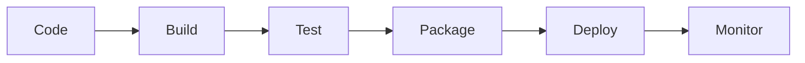

# CI/CD with a Java application
## Pipeline Stages \& Gradle Lifecycle

### Traditional Software Lifecycle
In a traditional life-cycle each of this steps is performed by hand, wasting time and resources




### Gradle Tasks Mapping to Pipeline Stages
Gradle has several task to accomplish different purpose

| Pipeline Stage | Gradle Task | Purpose | Command |
| :-- | :-- | :-- | :-- |
| **Source** | - | Code checkout from Git | `git clone/pull` |
| **Build** | `compileJava` | Compile source code | `./gradlew compileJava` |
| **Test** | `test` | Run unit tests | `./gradlew test` |
| **Integration Test** | `integrationTest` | Run integration tests | `./gradlew integrationTest` |
| **Quality Check** | `check` | Code quality analysis | `./gradlew check` |
| **Package** | `bootJar` | Create executable JAR | `./gradlew bootJar` |
| **Publish** | `publish` | Push artifacts to registry | `./gradlew publish` |
| **Deploy** | - | Deploy to target environment | Custom scripts/tools |

### Complete Gradle Build Lifecycle
A complete life cycle start with *cleaning* old build files, then compile everything in a single app and create a `jar`/`war` package ready to be deployed to the *server*/*cloud*

```bash file:"Gradle life-cycle"
# Complete pipeline in one command
./gradlew clean build bootJar # [!note] delete old build files, compile from source, package into Jar package

# Broken down:
./gradlew clean            # [!note] Clean previous builds
./gradlew compileJava      # [!note] Compile main source
./gradlew compileTestJava  # [!note] Compile test source  
./gradlew test             # [!note] Run unit tests
./gradlew integrationTest  # [!note] Run integration tests (if configured)
./gradlew check            # [!note] Run quality checks (SpotBugs, Checkstyle)
./gradlew bootJar          # [!note] Package Spring Boot application
```

## Git Workflow Integration
GitHub Actions transforms your repository into an **automated software factory** through `YAML` configuration files that define *when*, *where*, and *how* your code gets built, tested, and deployed.

### File Structure & Location
GitHub automatically **scans** `.github/workflows/` for `*.yml` or `*.yaml` files and registers them as executable workflows. No manual configuration needed.
```bash file:"File tree"
your-repository/ 
└── .github/ 
    └── workflows/ 
        ├── ci.yml              # [!note] Continuous Integration 
        ├── deploy.yml          # [!note] Deployment workflows   
        ├── pr-validation.yml   # [!note] Pull Request checks 
        └── release.yml         # [!note] Release automation 
```

### Essential Components

Every GitHub Actions workflow follows this structure
```yaml file:"GitHub Automation file framework"
name: Workflow Display Name                  # [!note] Appears in GitHub UI
on:                                          
  push:
    branches: [ main ]                       # [!note] When to trigger
  pull_request:
    branches: [ main ]                       # [!note] When to trigger

jobs:                                        
  job-name:
    runs-on: ubuntu-latest                   # [!note] Virtual machine OS
    steps:
      - name: Step Description               # [!note] Human-readable step name
        uses: actions/checkout@v4            # [!note] Pre-built action
        
      - name: Custom Command          
        run: echo "Hello World"              # [!note] Shell command execution
        
      - name: Conditional Step
        if: github.ref == 'refs/heads/main'  # [!note] ⚡ Conditional logic
        run: echo "Only on main branch"

```

### Branch Strategy Example for CI/CD
The typical feature branch workflow starts creating a `feature/something` branch from `main`, makes commits to implement a new feature, adding tests first, then the actual implementation code, followed by successful *PR validation* through automated tests.
Merges back to `main`, and then triggers an automated *CI/CD pipeline* that builds *next version* and *automatically deploys it to production* only if *all automation tests are passed*.

![[CI-CD with GitHub automation|800]]

---

![[Lessons/Day 17/__block/Links]]