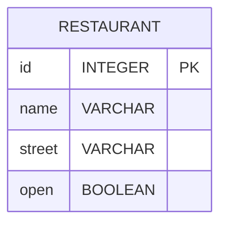

# `Mono<T>`
A Reactive Streams [`Publisher`](https://www.reactive-streams.org/reactive-streams-1.0.3-javadoc/org/reactivestreams/Publisher.html?is-external=true "class or interface in org.reactivestreams") with basic rx operators that emits at most one item _via_ the `onNext` signal then terminates with an `onComplete` signal (successful `Mono`, with or without value), or only emits a single `onError` signal (failed Mono).

## Documentation [[\^1](https://projectreactor.io/docs/core/release/api/reactor/core/publisher/Mono.html)]
Most `Mono` implementations are expected to immediately call [`Subscriber.onComplete()`](https://www.reactive-streams.org/reactive-streams-1.0.3-javadoc/org/reactivestreams/Subscriber.html?is-external=true#onComplete-- "class or interface in org.reactivestreams") after having called `Subscriber#onNext(T)`. [`Mono.never()`](https://projectreactor.io/docs/core/release/api/reactor/core/publisher/Mono.html#never--) is an outlier: it doesn't emit any signal, which is not technically forbidden although not terribly useful outside of tests. On the other hand, a combination of `onNext` and `onError` is explicitly forbidden.

![[Reactive - Mono intro|1200]]

The rx operators will offer aliases for input [`Mono`](https://projectreactor.io/docs/core/release/api/reactor/core/publisher/Mono.html "class in reactor.core.publisher") type to preserve the "*at most one*" property of the resulting [`Mono`](https://projectreactor.io/docs/core/release/api/reactor/core/publisher/Mono.html "class in reactor.core.publisher"). For instance [`flatMap`](https://projectreactor.io/docs/core/release/api/reactor/core/publisher/Mono.html#flatMap-java.util.function.Function-) returns a [`Mono`](https://projectreactor.io/docs/core/release/api/reactor/core/publisher/Mono.html "class in reactor.core.publisher"), while there is a [`flatMapMany`](https://projectreactor.io/docs/core/release/api/reactor/core/publisher/Mono.html#flatMapMany-java.util.function.Function-) alias with possibly more than 1 emission.

`Mono<Void>` should be used for [`Publisher`](https://www.reactive-streams.org/reactive-streams-1.0.3-javadoc/org/reactivestreams/Publisher.html?is-external=true "class or interface in org.reactivestreams") that just completes without any value.

## SpringBoot Project
### Create new project from [start.spring.io](https://start.spring.io/)
Create a new project through [start.spring.io](https://start.spring.io/) UI or via `cli` and give it proper name
```sh file:"New SpringBoot project download command" hlt:|$PROJECTNAME,13|webflux 
curl https://start.spring.io/starter.zip               \
  -d type=gradle-project                               \
  -d language=java                                     \
  -d bootVersion=3.5.5                                 \
  -d baseDir=$PROJECTNAME                              \
  -d groupId=org.booleanuk                             \
  -d artifactId=$PROJECTNAME                           \
  -d name=$PROJECTNAME                                 \
  -d description="Demo project for Spring Boot"        \
  -d packageName=org.booleanuk.demo                    \
  -d packaging=jar                                     \
  -d javaVersion=21                                    \
  -d dependencies=webflux,devtools,postgresql,data-jpa \ # [!note] Note the `webflux` dependency instead of `web`
  -o "$PROJECTNAME".zip
```

### Setup
#### Dependencies & Properties
The *OAuth2* require *resource server* dependency, while in the property file makes sure the proper *server port* and *uri of the issuer* are in place
```gradle file:build.gradle group:setting
dependencies {  
	// webflux starter & test
    implementation 'org.springframework.boot:spring-boot-starter-webflux'  
    testImplementation 'org.springframework.boot:spring-boot-starter-test'  
    testImplementation 'io.projectreactor:reactor-test'  
    testRuntimeOnly 'org.junit.platform:junit-platform-launcher'  
  
    // database  
    implementation("org.postgresql:postgresql:42.7.7")  
  
    // lombok  
    implementation("org.projectlombok:lombok:1.18.38")  
    annotationProcessor 'org.projectlombok:lombok:1.18.38'  
    testAnnotationProcessor 'org.projectlombok:lombok:1.18.38'  
}
```

### `Mono` Example Controller
In order to test `Mono` capabilities, let's create a new `MonoController.java` file
```java file:MonoController.java
@RestController
@RequestMapping("api/mono")
public class MonoController {

    @GetMapping("hello")
    public Mono<String> hello() {
        return Mono.just("Hello, Mono!"); // [!note] Switch data type `RawData --> Mono<RawData>`
    }

    @GetMapping("uuid")
    public Mono<String> uuid() {
        return Mono.fromSupplier(() -> UUID.randomUUID().toString()) // [!note] Extenral supplier simulation
			.map(u -> "generated=" + u);
    }

    @GetMapping("maybe")
    public Mono<ResponseEntity<String>> maybe(@RequestParam Optional<String> name) {
        return Mono.justOrEmpty(name) // [!note] How to deal with `Optional` values
			.map(n -> ResponseEntity.ok("hi " + n))
			.defaultIfEmpty(ResponseEntity.ok("hi guest"));
    }

    @GetMapping("delayed")
    public Mono<String> delayed() {
        return Mono.delay(Duration.ofMillis(2000)) // [!note] Delay simulation
			.map(tick -> "ready after 2s");
    }
    
    @GetMapping("fromCallable")  
	public Mono<String> fromCallable() {  
	  
	    return Mono.fromCallable(() -> { // [!note] Define a callable method
	        Thread.sleep(2000); // [!note] Simulate a blocking operation  
	        return "ready after 2s";
	    }).subscribeOn(Schedulers.boundedElastic()); // [!note] Offloads to separate thread pool
	}
}
```

### Real world scenario
Given a **Restaurant Manager App** with a very simple `Restaurant` table



And all related class (*entity*, *dto*, *repository* and *service*)
```java file:Restaurant.java group:restaurant
@Entity  
@Data  
@NoArgsConstructor  
@AllArgsConstructor  
public class Restaurant {  
    @Id  
    @GeneratedValue(strategy = GenerationType.IDENTITY)  
    private Integer id;  
  
    @Column(nullable = false)  
    private String name;  
  
    @Column(nullable = false)  
    private String street;  
  
    @Column(nullable = false)  
    private boolean open = false; // Default to closed  
  
    public Restaurant(RestaurantDto dto) {  
  
        setName(dto.getName());  
        setStreet(dto.getStreet());  
    }  
}
```
```java file:RestaurantDto.java group:restaurant
@Data  
@NoArgsConstructor  
@AllArgsConstructor  
public class RestaurantDto {  
    private String name;  
    private String street;  
}
```
```java file:RestaurantRepo.java group:restaurant
@Repository  
public interface RestaurantRepo extends JpaRepository<Restaurant, Integer> {  
}
```
```java file:RestaurantService.java group:restaurant
@Service  
public class RestaurantService {  
  
    @Autowired  
    private RestaurantRepo repository;  
  
    public List<Restaurant> findAll() {  
        return repository.findAll();  
    }  
  
    public Optional<Restaurant> findById(Integer id) {  
        return repository.findById(id);  
    }  
  
    public Restaurant create(RestaurantDto dto) {  
  
        return create(new Restaurant(dto));  
    }  
    public Restaurant create(Restaurant restaurant) {  
  
        return repository.save(restaurant);  
    }  
  
    public Optional<Restaurant> update(Integer id, RestaurantDto dto) {  
        return repository.findById(id).map(existing -> {  
            existing.setName(dto.getName());  
            existing.setStreet(dto.getStreet());  
            return repository.save(existing);  
        });  
    }  
  
    public void delete(Integer id) {  
        repository.deleteById(id);  
    }  
}
```

#### Client Requests
> [!note] **Restaurant Manager** Story
> As a **restaurant manager**, I want to **toggle my restaurant's open/closed status with a single API call**, so that **I can quickly update my availability without managing complex state transitions**.

> [!note] **Customer/Client** Story
> As a **hungry customer**, I want to **automatically receive restaurant details as soon as it opens**, so that **I don't have to repeatedly check if my favorite restaurant is available and can place my order immediately**.

> [!note] **API Consumer** Story
> As a **third-party application developer**, I want to **subscribe to restaurant opening events through a non-blocking endpoint**, so that **my app can efficiently handle multiple restaurant status requests without blocking threads or overwhelming the server with polling**.

#### Controller Implementation
**Lazy Execution with `Mono.fromCallable()`** The blocking JPA operations are wrapped in `Mono.fromCallable()`, which defers execution until *subscription occurs*. The lambda containing database calls only runs when *WebFlux* subscribes to the `Mono`, not when the method is called.
```java file:RestaurantController
@GetMapping  
public Mono<List<Restaurant>> getAllRestaurants() {  
	return Mono.fromCallable(() -> restaurantService.findAll())  
		.subscribeOn(Schedulers.boundedElastic()); // [!note] Offloads the blocking fetch to a dedicated, capped worker pool, protecting the event‑loop threads and preserving reactive responsiveness
}  

@PostMapping  
public Mono<Restaurant> addRestaurant(@RequestBody RestaurantDto restaurantDto) {  
	return Mono.fromCallable(() -> restaurantService.create(restaurantDto))  
		.subscribeOn(Schedulers.boundedElastic());  
}  
```
> [!note] Make sure the `.subscribeOn(Schedulers.boundedElastic())` call is just after `Mono.fromCallable` for better *performance*

**Recursive call to `pollUntilOpen()`** The recursive call to `pollUntilOpen()` check once per second the state of the restaurant until it will be found *open*, then come back with `Restaurant` details
```java file:RestaurantController hlt:13|polluntilopen(id)
private Mono<Restaurant> pollUntilOpen(int id) {  
	return Mono.fromCallable(() -> restaurantService.findById(id))  
		.subscribeOn(Schedulers.boundedElastic())  
		.flatMap(restaurantOpt -> {  

			Restaurant restaurant = restaurantOpt.get();  

			if (restaurant.isOpen())  // [!note] Check if `Restaurant` is `open` or not
				return Mono.just(restaurant); // [!note] It is, so get back with data
			else // [!note] It's not, so let's try again in 1 second
				return Mono.delay(Duration.ofSeconds(1))  
					.then(pollUntilOpen(id)); // [!note] Recursive call to `pollUntilOpen` method
		});  
}  
```

Now implement the method to *toggle the state of `Restaurant`* and to *query `Restaurant` information when it's open*

**Toggle and check until open end-points** Concurrent access from several clients give the ability to drive operation through events (*Event-Driven Architecture*). While a client is waiting for state change of specific `Restaurant`, the other one can concurrently change it's state, unlocking the state of the first one.
```java file:RestaurantController
@PutMapping("/{id}/open")
public Mono<ResponseEntity<Void>> toggleRestaurantOpen(@PathVariable int id) {  
  
    return Mono.fromCallable(() -> {  
        Optional<Restaurant> restaurantOpt = restaurantService.findById(id);  
        if (restaurantOpt.isEmpty()) {  
            return ResponseEntity.notFound().<Void>build();  
        }  
  
        Restaurant restaurant = restaurantOpt.get();  
        restaurant.setOpen(!restaurant.isOpen()); // [!note] Update the state
        restaurantService.create(restaurant);  
  
        return ResponseEntity.ok().<Void>build();  
    }).subscribeOn(Schedulers.boundedElastic());  
} 

@GetMapping("/{id}/open")  
public Mono<ResponseEntity<Restaurant>> waitForRestaurantOpen(@PathVariable int id) {  

	return Mono.fromCallable(() -> restaurantService.findById(id))  
		.subscribeOn(Schedulers.boundedElastic())  
		.flatMap(restaurantOpt -> {  

			if (restaurantOpt.isEmpty()) 
				return Mono.just(ResponseEntity.notFound().<Restaurant>build());  

			Restaurant restaurant = restaurantOpt.get();  

			if (restaurant.isOpen()) // [!note] If `Restaurant` is open come back with data
				return Mono.just(ResponseEntity.ok(restaurant));  

			return pollUntilOpen(id) // [!note] If it's not, start polling data every second until it is
					.timeout(Duration.ofMinutes(2)) // [!note] Set a timeout limit
					.map(ResponseEntity::ok) // [!note] Wrap response from `pollUntilOpen` method into a `ResponseEntity` 
					;  
		});  
}  
```

---

# Links
![[Lessons/Day 18/__blocks/Links]]