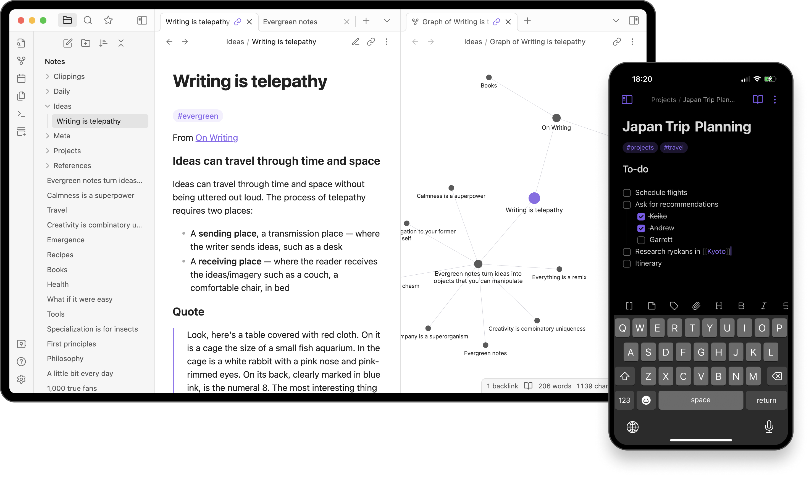
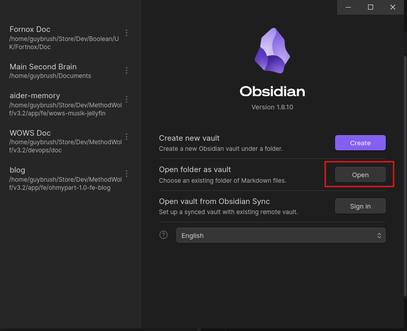
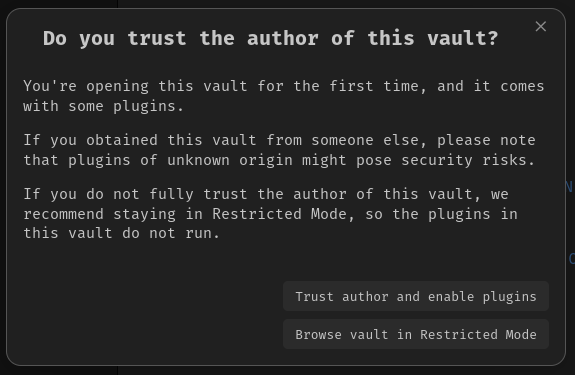

## Obsidian

  
  
  This repository is build for the [Obsidian.md](https://obsidian.md/). If you don't have it, please download through you application manager.

## Clone repository


Clone or fork the repository, and then open the folder with [Obsidian.md](https://obsidian.md/)

> [!info] External Submodules
> If you miss some external submodule repo content, just issue following command in order to populate them:
> ```sh
> git submodule update --init --recursive
> ```

## [OPTIONAL] Obsidian Plug-in


In order to have a better experience, please activate plugins from author.